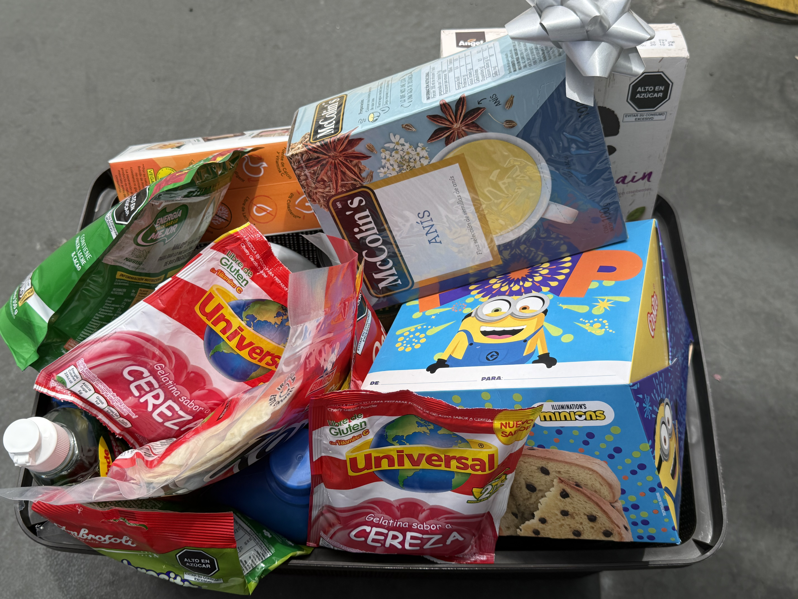

# 🎄 Canasta Navideña – Test Presentation

This document presents the **Canasta Navideña** assembled as part of an internal company test.
The objective was to build a complete and well-presented basket with food, household, and festive items.

## 📸 Canasta Preview

### View 1

### View 2

> Images correspond to the final canasta used for evaluation.

## 📦 Included Items

### Food & Beverages
- Panetón
- Chocolate (Milo)
- Gelatina
- Galletas
- Leche (Gloria)
- Bebida de almendra (Vio)
- Conservas
- Anís
- Mayonesa
- Snacks y dulces

### Household Items
- Detergente
- Lejía
- Lavavajilla
- Esponjas de limpieza

### Presentation
- Canasta plástica
- Moño decorativo navideño

## ⚠️ Issues / Observations

- The final cost of the canasta exceeded the target budget by **1 sol**.
- The total amount reached **S/ 251**.

## ✅ Conclusion

The canasta provides a **complete and practical selection** of products with a festive presentation.  
Only a minimal adjustment would be required to strictly meet the defined budget.
